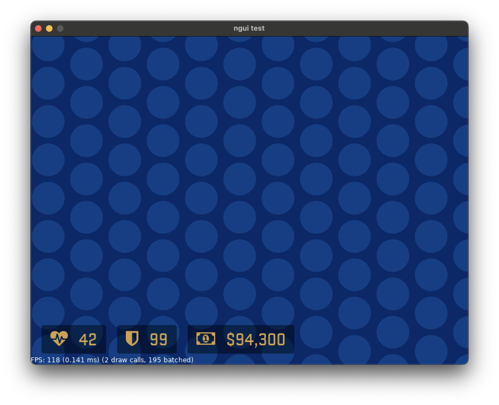

# ngui
GUI framework for Love2D written in pure Lua. Some features:

* Structured syntax for defining UI
* Layout engine
* CSS-like styling
* Live reload
* Optimized rendering



```
hbox#stats
	hbox#hp.element
		icon "heartbeat"
		label "42"
	hbox#armor.element
		icon "shield"
		label "99"
	hbox#money.element
		icon "money"
		label "$94,300"
```

To run a demo of the framework, simply run this repository as a Love2D project itself. **To actually
use the framework**, copy the `ngui` folder to your own project and include it using `require`:

```lua
local ngui = require('ngui')
```

This framework is not actively maintained, but if you are interested, I'm open to reviewing and
accepting any and all contributions.

## Usage
To start off, you need to call `ngui.init` in `love.load`.

```lua
local ngui = require('ngui')

function love.load()
	ngui.init()
end
```

After initializing the framework, call `ngui.load` to load an `.ngui` file.

```lua
ngui.load('assets/test.ngui')
```

In `love.update`, call `ngui.update`, and in `love.draw`, call `ngui.draw`.

```lua
function love.update(dt)
	ngui.update(dt)
end

function love.draw()
	ngui.draw()
end
```

Now your UI should render!

If you also want to handle events, you need to pass a "sink" parameter to the `ngui.load` function
as well, for example:

```lua
ngui.load('assets/test.ngui', {
	foobar = function()
		print('Foobar!')
	end,
})
```

The `ngui.load` function also returns the "host" object of the loaded UI. This lets you do several
things, such as selecting and updating widgets at runtime:

```lua
ui = ngui.load('assets/test.ngui')
ui:select('#foo'):setText('Foo from code!')
```

## Available widgets
The current list of available built-in widgets are:

* `box`, `vbox`, `hbox`: boxes that contain and layout child widgets
* `label`: static text
* `button`: things you can click
* `checkbox`: things you can check
* `image`: renders an image
* `icon`: renders a [ForkAwesome](https://forkaweso.me/Fork-Awesome/) icon

## Syntax of `.ngui` files
UI's are defined using an indent-based structured format. Tabs **must** be used for this. Internally
the structure is tree-like similar to an XML node structure, where each node can have properties, a
name, child nodes, and content.

A simple example of the basic features that can be in a document:

```
first
	item
		item
		item
			item
	item
	item

second
	foo
		bar

	foo
	foo "content"

	foo 12345
	foo 3.14159
	foo 0x12345678

	foo#my_id "content"
	foo.class_name
	foo:modifier_type

	foo "content" attr="123" @event="callback" $styleattr="123"
```

The content for a node can be a string or a number. Strings are always within quotation marks.
Numbers can be in any format that `tonumber` accepts (see also the definition of *numeric constant*
in [Lua's lexical conventions](https://www.lua.org/manual/5.3/manual.html#3.1)).

Node ID's are typed as part of the node name. For example, while `foo` is just a regular node, using
`foo#my_id` is a node with an ID of `my_id`. ID's are useful where you want to get a specific widget
in your UI, which can be done using `Widget:findById`. Only 1 ID may be set per widget.

Similar to CSS in HTML, you can add a class name to widgets. Currently you may only specify a single
class per widget. Specify the class name prefix with a period, for example: `foo.class_name`. This
class name will then correspond to a style node structure if it was specified (see below), and may
also be used as a way to search for nodes using `Widget:findByClassName`.

You may also use `!include` instead of a node name to include another `.ngui` file at that location
in the node tree.
